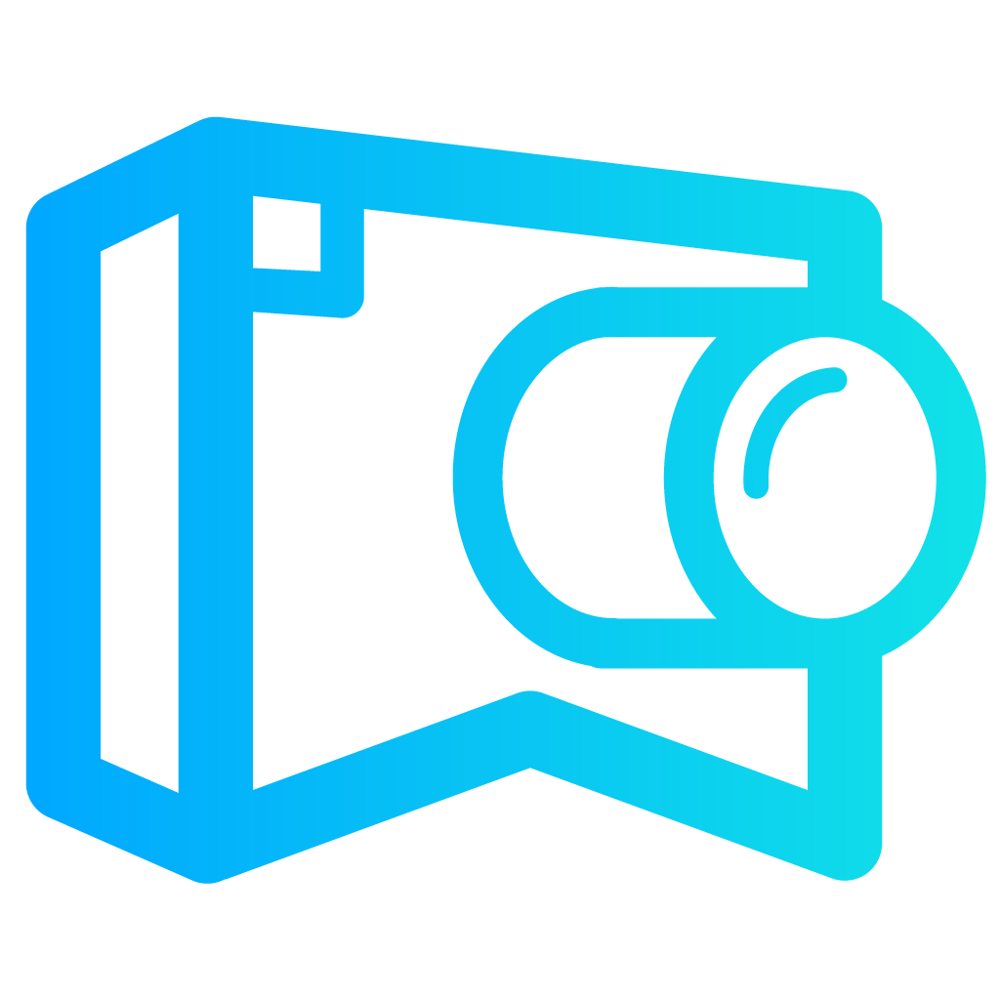
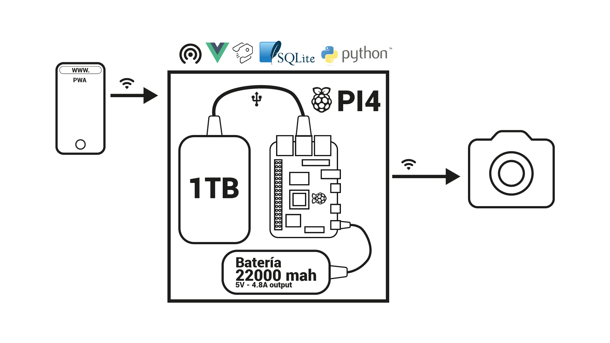

<p align="center">
  
</p>

# PhotoHub


** For `spanish version` --> [Spanish version](./README_ES.md)

## Introduction
---

This project was made as the final assigment for the Multimedia Design Degree from the Faculty of Arts at the UNLP (National University of La Plata)

## Problem
---

Many times photographers and videographers find themselves in a remote place, without storage in the memory card, and without possibility of making a copy because a computer is needed. Therefore, they can't keep working, or they have to revise the content of the memory card and select something to delete.

Another problem is the organization of files. Usualy, content creators have to go to social events, and they need to hand in the footage/images of the day inmediatly. So, they have to organize the files, select them and, in ocations, edit them on the go. This requires a big hardware at hand, for example a laptop.

## Proposal
---

This product was designed to overcome this issues by catalogin and making an ordered backup avoiding redundancy, to a hard disk. These files are accessibles from any device that can run a browser and have wifi connection. All these packed in a portable device and without the need of internet connection.

Given the size of the project and its requirements I've made a prototipe of the MVP (Minimum viable product) that can show the general purpose of the assigment.

## MVP
---

Project requirements:

- a web app where the user can review the files, classify and search media by filter and the photos settings.

- a device capable of storing a big amount of data and serve a database and an interface to access and change the data.

For this I used a Raspberry Pi4 in which I mounted a server running Strapi CMS. This puts a SQLite database at disposal and enables an api REST with different endpoints as interface.
Also, I've installed a client server which runs in Vuejs to generate a visual interface that is great to let the user interact with the database in a transparent way.

The camera connection was made utilizing a software available in this repo https://github.com/shezi/airmtp wich is included here in the folder `/airmtp`. This code let us download the files from the camera in realtime or the files stored in the camera's memory afterwards. The software set a files directory on our PC to save the files. So I've made a folder watcher that send request to store the files on the actual backend every time a new file is created in the folder.

There is a system of alerts an notifications, that was made utilizing Soket.io, whenever a file is stored by the backend application.



## Web App's screeens


## Instalation
---

- NodeJS is required.
This can be downloaded and installed from https://nodejs.or/ selecting the OS version you are using.

## 1 - Download the project:
  - Using GIT:

    ```
    git clone https://github.com/pabloScaramutti/PhotoHub.git
    ```
  - Or downloading the .zip file from the `Code` menu.

## 2 - Installing packages

When the project is downloaded, you have to enter from the terminal or commands console of your computer to the directory `api-tesis` and execute the command `npm install`. 
The same goes with the directory `client-tesis`.

## 3 - Init the Strapi server and client

Inside of the directory `api-tesis` execute: `npm run develop`.

Inside of the directory `client-tesis` execute: `npm run serve`
