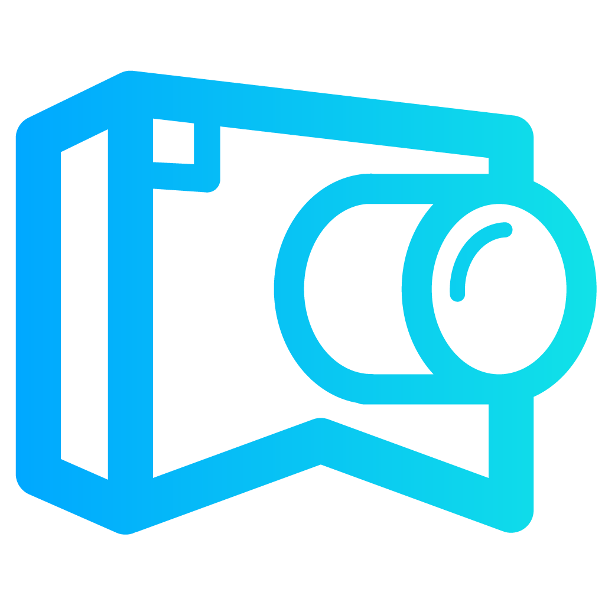
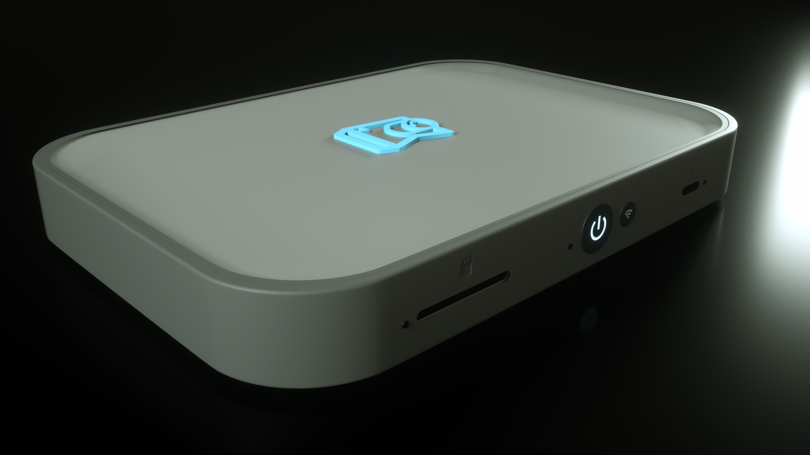
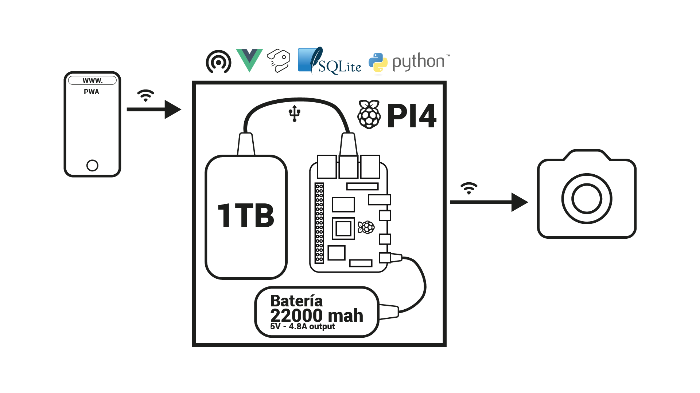
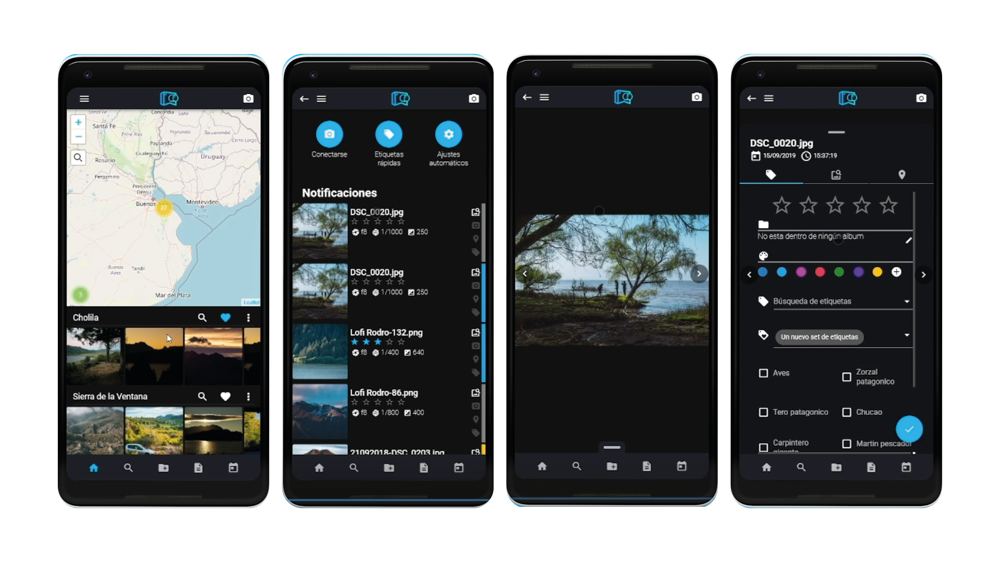

<p align="center">
  
</p>

# PhotoHub



** For `english version` --> [English version](./README.md)

## Introducción

Este proyecto fue realizado como trabajo final de la Lic. en Diseño Multimedial de la Facultad de Artes en la UNLP.

## Problematica

Muchas veces, los fotógrafos y videografos se encuentran con la situación de estar en un lugar remoto y quedarse sin espacio en la tarjeta de memoria, sin posibilidad de hacer una copia por falta de una computadora. Esto quiere decir que pase lo que pase ya no pueden seguir trabajando, o tienen que ponerse a revisar qué borrar.

Otro de los problemas es la organización del material. Muchas veces los productores de contenido concurren a eventos sociales y necesitan entregar el material de la jornada lo antes posible. Esto quiere decir que se debe ordenar, seleccionar y en ocasiones editar las fotos rápidamente. Para esto en general depende de tener una computadora cerca, poder copiar los archivos, seleccionarlos, y luego editarlos y/o enviarlos.

## Propuesta

Este producto viene a solucionar estas cuestiones a partir de catalogar y hacer una copia de seguridad ordenada y sin redundancia a un disco rígido que, además, funciona como un punto de acceso por el cuál se podrán traspasar los archivos entre dispositivos en cualquier lugar y a cualquier dispositivo que tenga Wi-Fi. Todo esto sin necesidad de contar con red eléctrica, ni conexión a internet.

Por el alcance del proyecto y el tamaño, lo que hice fue prototipar un MVP que pueda dar cuenta del objetivo general del trabajo.

## MVP

El proyecto requería: 
- una web app en donde se podría revisar las fotos, catalogarlas y buscar archivos mediante filtros y la catalogación antes realizada.
- Un dispositivo capaz de gestionar el almacenamiento de los datos y servir de interfaz para poder ver los datos.

Para esto utilicé una Raspberry Pi4, en la que monté un servidor con el CMS Strapi que permite utilizar una base de datos SQLite y habilita endpoints como interfaz (API REST).
También, instalé un servidor cliente hecho en Vuejs para generar una interfaz visual para el usuario y hacer transparente la comunicación con la api.

La conexión con la cámara fue realizada a partir del repositorio https://github.com/shezi/airmtp que se incluye dentro de la carpeta `/airmtp`. Con esto se pueden bajar las imagenes tomadas con una cámara a una determinada carpeta de una PC. Luego realicé un folder watcher, que se comunica con el backend de PhotoHub para cargar las nuevas fotos.

Existe un sistema de alertas y notificaciones, desde el back hacia el front cuando se registra una nueva foto, que fue realizado con la librería Socket.io



## Pantallas Web App



## Instalación

- Se requiere NodeJS instalado en el sistema.
Se puede instalar desde la página https://nodejs.org/ de acuerdo con tu sistema operativo.

## 1 - Descargar proyecto:
  - Utilizando GIT:

    ```
    git clone https://github.com/pabloScaramutti/PhotoHub.git
    ```
  - Descargando el .zip desde el menú `Code`

## 2 - Instalando paquetes

Una vez descargado el proyecto, entrar desde la terminal o la consola de comandos de Windows al directorio `api-tesis` y `client-tesis`. En ambos directorios ejecutar el comando `npm install`

## 3 - Iniciar el servidor de Strapi y el cliente

Dentro del directorio `api` ejecutar: `npm run develop`

Dentro del directorio `cliente` ejecutar: `npm run serve`
